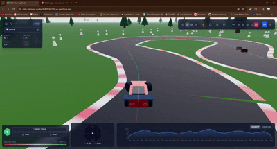

# Path Planning Studio

Advanced autonomous racing trajectory planner with cone-based tracks, RRT* + QP racing line optimisation, and real-time telemetry in a 3D scene.

This repo contains a standalone front-end built with React, TypeScript and Vite. It is designed for Formula Student / autonomous racing experiments, but can be reused for any cone-based track.

---

## Features

- **Cone-based track editor**
  - Import track layouts from CSV (blue / yellow / orange cones).
  - Start / finish and car start cones supported.

- **3D visualisation**
  - `@react-three/fiber` + `three.js` rendering.
  - Multiple camera modes: orbit, chase, cockpit, helicopter.
  - Day / night toggle and simple world environment.

- **Trajectory generation**
  - Centerline generation from blue / yellow cones with dynamic track width.
  - Conversion to a dense path (`PathPoint[]`) with curvature and arc-length.
  - Real-time update of the path when cones are edited.

- **Racing line optimisation (offline)**
  Optimisers are implemented in `services/mathUtils.ts` and selectable from the UI:
  - `Laplacian`: smooths the centerline with a simple Laplacian filter.
  - `RRT` (RRT* shortcutting): stochastic search for shorter, valid shortcuts along the track.
  - `QP` (biharmonic smoothing / minimum curvature): minimises curvature while staying inside the track.
  - `Hybrid`: blends QP with Laplacian for a compromise between curvature and distance.
  - `RRT_QP`: pipeline RRT* + QP (first shortcut, then smooth the result).
  - `Local`: small-horizon local planner around the car (5-cone window) for more “online” behaviour.

- **Simulation, ghost and telemetry**
  - Car follows the selected trajectory with a simple longitudinal model (velocity, accel / brake).
  - Ghost car showing the “fastest” precomputed RRT_QP lap.
  - Live G-G diagram (lateral vs longitudinal g).
  - Velocity and g-force charts along the lap using Recharts.

---

## Demo (GIFs)

Create a `docs/` (or `assets/`) folder and export three GIFs from screen recordings of the app. The README assumes the following filenames; you can change them if you prefer.

### 1. RRT* + QP racing line (main GIF)





### 2. Site overview / UI tour


---

## Online deployment

Path Planning Studio is also deployed on the web using **Google Cloud Run**.

- Live URL (production): https://path-planning-studio-974707427282.us-west1.run.app/

You can open this link directly in a browser to:
- try the track editor and trajectory planners without installing anything locally,
- record the three demo GIFs described above using your favourite screen capture tool.

---

## Getting started (local)

### Prerequisites

- Node.js (recommended: 20.x or newer)
- npm (comes with Node)

### Install and run

```bash
# Install dependencies
npm install

# Run dev server (Vite)
npm run dev
```

By default Vite serves on `http://localhost:5173` (or the port shown in your terminal).

### Environment variables

There is a `.env.local` file with:

```bash
GEMINI_API_KEY=PLACEHOLDER_API_KEY
```

Right now the UI does not call any external LLM, so you can leave this as a dummy value.  
It is only wired into `vite.config.ts` as `process.env.GEMINI_API_KEY`.

---

## Project structure

At the root of the repo:

- `index.html` – Vite entry page, Tailwind CDN, fonts.
- `index.tsx` – React entry point.
- `App.tsx` – main application container, view routing, state management.
- `components/`
  - `Scene3D.tsx` – 3D scene, cones, paths, car and cameras.
  - `Car.tsx` – car model, kinematics and suspension / body roll effects.
  - `TrackObjects.tsx` – cone meshes and track geometry.
  - `UIOverlay.tsx` – controls, charts, G-G diagram and HUD.
  - `LandingPage.tsx` – landing / home page with track selector.
  - `AlgorithmsPage.tsx` – explanatory view for optimisation modes.
  - `SimulationsPage.tsx` – space for more scenario-based demos.
- `services/`
  - `mathUtils.ts` – CSV parsing, centerline and all trajectory optimisers (Laplacian, RRT*, QP, Hybrid, RRT_QP, Local).
- `types.ts` – shared TypeScript types (cones, paths, metadata, cameras, optimiser modes).
- `constants.ts` – physics parameters and visual colours for cones / paths.
- `vite.config.ts` – Vite configuration and environment variable mapping.
- `package.json` – dependencies and npm scripts.

---

## Typical workflow

1. Start the dev server (`npm run dev`) or open the online demo URL.
2. On the landing page, choose or import a track (CSV of blue / yellow / orange cones).
3. Adjust the layout in the editor if needed (drag cones, tweak corners).
4. Select an optimiser (NONE / Laplacian / RRT / QP / Hybrid / RRT_QP / Local).
5. Enable ghost and AI race mode if you want comparisons.
6. Press play to launch a lap and inspect:
   - the trajectory in 3D,
   - the G-G diagram,
   - the longitudinal charts.

Record your screen for the three scenarios described in the **Demo** section and export them as GIFs to complete the README.
